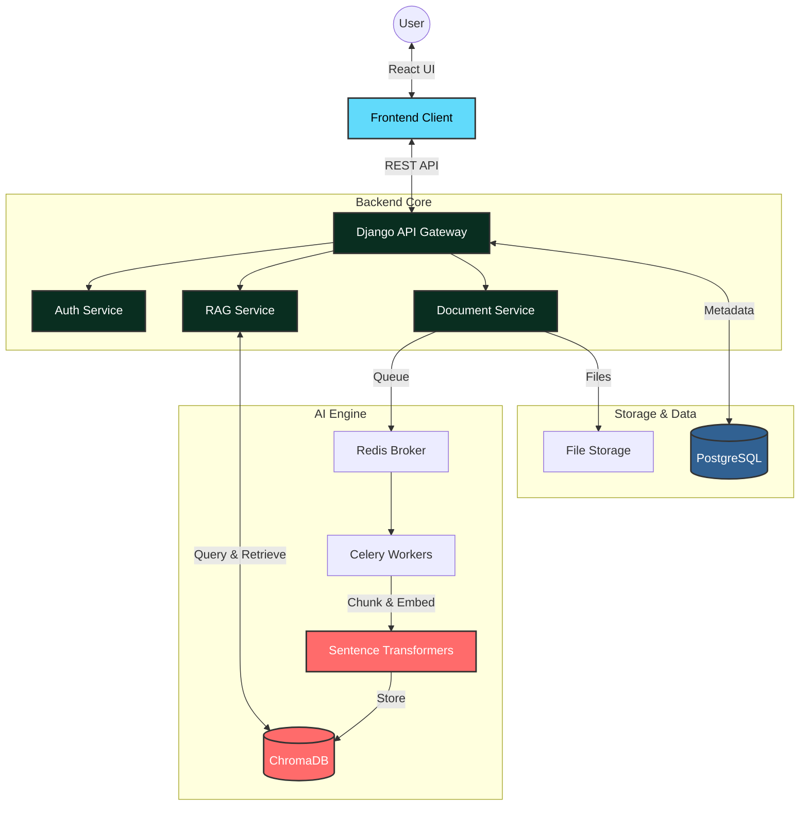
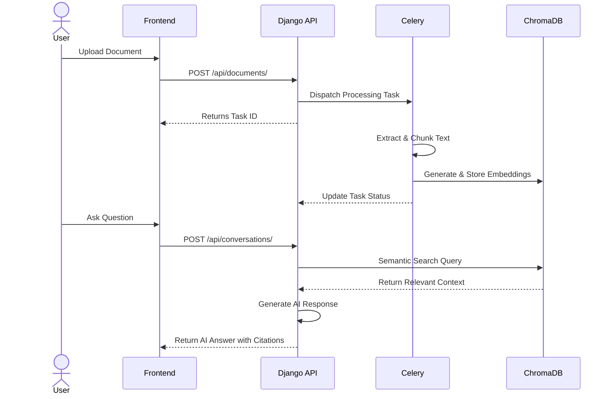

<div align="center">
  

  <h1>🧠 Document Intelligence & RAG Platform 🤖</h1>
  
  <p>
    <a href="https://git.io/typing-svg">
      
    </a>
  </p>
  
  <p>
    <a href="https://skillicons.dev">
      
    </a>
  </p>

  <p>
    
    
    
    
  </p>
</div>

<br/>

<br/>

> **Welcome to your intelligent workspace.** This platform transforms how you interact with your data by allowing you to seamlessly upload documents, extract knowledge with intelligent chunking, and communicate with an AI assistant powered by a highly efficient **Retrieval-Augmented Generation (RAG)** pipeline—complete with exact document citations.

<br/>

## 📋 Table of Contents

- [✨ Key Features](#key-features)
- [🎯 Use Cases](#use-cases)
- [🏗️ Architecture & Flow](#architecture-flow)
- [🧠 RAG Pipeline Explained](#rag-pipeline)
- [📁 Project Structure](#project-structure)
- [💻 Setup & Installation](#setup-installation)
- [📡 API Documentation](#api-documentation)
- [🛣️ Roadmap](#roadmap)
- [🤝 Contributing](#contributing)
- [❓ FAQ & Troubleshooting](#faq)

<br/>

<br/>

## <a id="key-features"></a>✨ Key Features

<table style="width:100%">
  <tr>
    <td width="50%">
      <h3>🔐 Authentication & Workspaces</h3>
      <ul>
        <li><b>Custom JWT Auth:</b> Secure access using refresh & access tokens.</li>
        <li><b>Multi-Tenancy:</b> Isolated, workspace-based environments for teams.</li>
      </ul>
    </td>
    <td width="50%">
      <h3>📄 Document Knowledge Base</h3>
      <ul>
        <li><b>Multi-Format:</b> Ingest PDF, DOCX, and TXT files instantly.</li>
        <li><b>Async Processing:</b> Heavy lifting managed by Celery & Redis.</li>
        <li><b>Vector Storage:</b> Embeddings indexed in ChromaDB.</li>
      </ul>
    </td>
  </tr>
  <tr>
    <td colspan="2">
      <h3>💬 Intelligent AI Chat (RAG)</h3>
      <ul>
        <li><b>Context-Aware Responses:</b> Engage in conversations with an AI that pulls context directly from your uploaded documents.</li>
        <li><b>Precise Citations:</b> Answers include traceable references to your exact documents and pages.</li>
        <li><b>Semantic Similarity Search:</b> Discover what you need without rigid keyword matching.</li>
      </ul>
    </td>
  </tr>
</table>

## <a id="use-cases"></a>🎯 Use Cases

- ⚖️ **Legal Teams**: Instantly cross-reference massive contracts and extract exact clauses.
- 🎓 **Academics & Researchers**: Talk to your PDFs and synthesize hundreds of research papers in seconds.
- 🏢 **Corporate HR**: Allow employees to query company handbooks and policies naturally.
- 👨‍💻 **Developers**: Upload API documentation or codebases and get contextual coding help.

<br/>

<br/>

## <a id="architecture-flow"></a>🏗️ Architecture & Flow

### System Architecture Diagram


<br/>

### User Interaction Flow


<br/>

<br/>

## <a id="rag-pipeline"></a>🧠 RAG Pipeline Explained

Our RAG architecture bridges the gap between static files and intelligent conversations. Here's a look under the hood:

<details>
<summary><b>🔍 1. Ingestion & Delegation</b> (Click to expand)</summary>
<br/>
You upload a document (PDF/DOCX/TXT). The backend immediately saves it and dispatches an asynchronous task to <b>Celery</b> so your UI never freezes.
</details>

<details>
<summary><b>✂️ 2. Extraction & Chunking</b> (Click to expand)</summary>
<br/>
The Celery worker extracts the raw text and applies intelligent chunking (preserving context across paragraphs and sections).
</details>

<details>
<summary><b>🧬 3. Embedding</b> (Click to expand)</summary>
<br/>
We utilize local embedding models (<code>sentence-transformers</code>) to convert text chunks into high-dimensional vector representations.
</details>

<details>
<summary><b>💾 4. Vector Storage</b> (Click to expand)</summary>
<br/>
These embeddings are indexed into <b>ChromaDB</b>, optimized for ultra-fast nearest-neighbor searches.
</details>

<details>
<summary><b>🎯 5. Retrieval & Generation</b> (Click to expand)</summary>
<br/>
When you ask a question, your prompt is embedded and compared against the vector database. The top semantically similar chunks are retrieved and passed to the LLM to generate an accurate, cited response.
</details>

## <a id="project-structure"></a>📁 Project Structure

```text
keerthi-projects-P-01/
├── backend/                 # Django Backend Application
│   ├── config/              # Django core settings & URLs
│   ├── auth/                # JWT and User models
│   ├── documents/           # Uploads, parsing & Celery tasks
│   ├── chat/                # RAG interactions & LLM integration
│   ├── requirements.txt     # Python dependencies
│   └── Dockerfile           # Backend container
│
├── frontend/                # React Frontend Application
│   ├── src/
│   │   ├── components/      # UI elements (ChatView, Sidebar)
│   │   ├── pages/           # Views (Dashboard, Login)
│   │   ├── App.tsx          # Main entrypoint
│   │   └── App.css          # Styles
│   └── package.json         # Node dependencies
│
├── docker-compose.yml       # Infrastructure orchestration
└── README.md                # Project documentation
```

<br/>

<br/>

## <a id="setup-installation"></a>💻 Setup & Installation

<details open>
<summary><b>🐳 Quick Start (Docker)</b></summary>
<br/>

1. **Copy Environment File:**
   ```bash
   cp .env.example .env
   ```
2. **Start Services:**
   ```bash
   docker-compose up -d
   ```
</details>

<details>
<summary><b>🛠️ Manual Local Setup</b></summary>
<br/>

**Backend:**
```bash
cd backend
python -m venv venv
source venv/bin/activate  # Windows: .\venv\Scripts\activate
pip install -r requirements.txt
python manage.py migrate

# Term 1: Celery Worker
celery -A config worker --loglevel=info

# Term 2: API Server
python manage.py runserver
```

**Frontend:**
```bash
cd frontend
npm install
npm run dev
```
</details>

<br/>

<br/>

## <a id="api-documentation"></a>📡 API Documentation

<details>
<summary><b>View API Endpoints</b></summary>
<br/>

### 🔐 Authentication
| Method | Endpoint | Description |
|--------|----------|-------------|
| `POST` | `/api/auth/register/` | Register a new user |
| `POST` | `/api/auth/login/` | Obtain JWT tokens |
| `GET`  | `/api/auth/workspaces/`| List all workspaces |

### 📄 Documents
| Method | Endpoint | Description |
|--------|----------|-------------|
| `POST` | `/api/documents/` | Upload a document |
| `GET`  | `/api/documents/tasks/<id>/` | Poll processing status |

### 💬 Conversations (RAG)
| Method | Endpoint | Description |
|--------|----------|-------------|
| `POST` | `/api/conversations/<id>/messages/` | Send a query to chat |

</details>

## <a id="roadmap"></a>🛣️ Roadmap

- [x] **Phase 1:** Core RAG Chat & Multi-tenant Workspaces
- [ ] **Phase 2:** Introduce Multi-Agent Task Management System
- [ ] **Phase 3:** Integration with Cloud Storage (AWS S3)
- [ ] **Phase 4:** Live WebSocket Streaming for AI responses

## <a id="contributing"></a>🤝 Contributing

We welcome contributions to make this project even better! 
1. Fork the repository
2. Create a feature branch (`git checkout -b feature/amazing-feature`)
3. Commit your changes (`git commit -m 'Add amazing feature'`)
4. Push to the branch (`git push origin feature/amazing-feature`)
5. Open a Pull Request

## <a id="faq"></a>❓ FAQ & Troubleshooting

<details>
<summary><b>Redis/Celery connection errors?</b></summary>
Make sure your Redis server is running. If using Docker, ensure the `redis` container is healthy.
</details>

<details>
<summary><b>Documents taking forever to process?</b></summary>
Check the Celery worker logs. Ensure the worker is started with `celery -A config worker --loglevel=info`.
</details>

<details>
<summary><b>CORS errors on frontend?</b></summary>
Verify that `CORS_ALLOWED_ORIGINS` in your Django `settings.py` includes `http://localhost:5173` (or your Vite dev server URL).
</details>

---

<br/>

<div align="center">
  
  <br/>
  <h2>🔥 Built for Scale, Designed for Humans 🔥</h2>
  <i>Developed with precision and ❤️ by <b>Keerthi</b>.</i>
</div>

